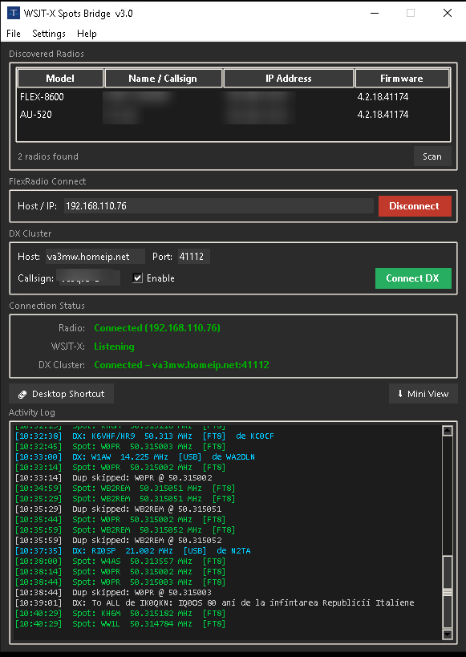

# SmartSpotter

**WSJT-X & DX Cluster spot bridge for FlexRadio SmartSDR**

SmartSpotter forwards decoded spots from WSJT-X and any DX Spider cluster node directly into FlexRadio SmartSDR's panadapter display via the SmartSDR TCP API. Compatible with **FLEX-6000**, **FLEX-8000**, and **Aurora** series radios. All modes supported.



---

## Features

- **WSJT-X integration** — listens on the WSJT-X UDP multicast stream and forwards FT8, FT4, and all other decoded spots to the radio
- **DX Cluster** — connects to any DX Spider node via telnet, parses incoming spots, and pushes them to the panadapter
- **Auto radio discovery** — finds FlexRadio SmartSDR radios on the local network via UDP broadcast; also accepts manual IP / FQDN entry
- **Spot deduplication** — configurable lifetime prevents the same spot flooding the panadapter
- **Filters** — CQ-only, POTA-only, or unfiltered; minimum SNR threshold
- **Custom colours** — separate colours for spots calling you, POTA spots, and DX Cluster spots
- **Auto-reconnect** — optional automatic reconnection if the DX Cluster telnet session drops
- **Mini-mode** — compact 300 × 60 strip for minimal screen footprint
- **Desktop shortcut** — one-click creation of a Windows `.lnk` shortcut with a custom icon
- **Dark UI** — dark-themed interface modelled after FlexHRD Bridge

---

## Requirements

### Python

Python 3.9 or later is required. Download from [python.org](https://www.python.org/downloads/).

### Required packages

| Package | Purpose |
|---|---|
| `tkinter` | GUI — included with the standard Python installer on Windows |

### Optional packages

| Package | Purpose | Install |
|---|---|---|
| `pillow` | Generates a proper `.ico` icon for the title bar and desktop shortcut | `pip install pillow` |
| `pywin32` | Required to create a Windows desktop shortcut | `pip install pywin32` |
| `winshell` | Required to create a Windows desktop shortcut | `pip install winshell` |

Install all optional packages at once:

```
pip install pillow pywin32 winshell
```

Or install everything from the included file:

```
pip install -r requirements.txt
```

---

## Installation

1. Clone or download this repository:
   ```
   git clone https://github.com/va3mw/SmartSpotter.git
   cd SmartSpotter
   ```

2. Install optional dependencies (recommended):
   ```
   pip install -r requirements.txt
   ```

3. Run:
   ```
   python smartspotter.py
   ```
   On Windows, use `pythonw.exe` to suppress the console window:
   ```
   pythonw smartspotter.py
   ```

4. Optionally use **File → Create Desktop Shortcut** to add a launcher to your desktop.

---

## Configuration

### FlexRadio

Select your radio from the **Discovered Radios** list or type its IP address manually, then click **Connect**.

### WSJT-X

SmartSpotter listens on the default WSJT-X multicast address `224.0.0.1` port `2237`. No changes are needed in WSJT-X — it broadcasts decoded spots automatically. The multicast group and port can be changed under **Settings**.

### DX Cluster

Enter your cluster node's **Host**, **Port**, and **login Callsign** in the DX Cluster panel, tick **Enable**, and click **Connect DX**. SmartSpotter handles the DX Spider telnet login sequence automatically, including an optional password.

Additional DX Cluster options are available under **Settings → DX Cluster**:

| Setting | Default | Description |
|---|---|---|
| Password | *(blank)* | Optional cluster login password |
| DX Spot Lifetime | 300 s | How long DX spots remain on the panadapter |
| Auto-reconnect | On | Automatically reconnect if the session drops |
| Reconnect Delay | 30 s | Seconds to wait before reconnecting |
| Colour – DX Cluster | `#00CCFF` | Panadapter colour for DX Cluster spots |

---

## Supported Radios

FLEX-6000, FLEX-8000 and Aurora Series.

Any radio running SmartSDR with the TCP API enabled should work.

---

## Settings

Open **Settings → Settings…** to configure:

- **My Callsign** — used to highlight spots where someone is calling you
- **Filter Mode** — `cq` (CQ calls only), `pota` (POTA activations only), or `none` (all decodes)
- **Min SNR** — ignore WSJT-X decodes below this signal-to-noise threshold
- **Spot Lifetime** — seconds before a WSJT-X spot expires on the panadapter
- **Colours** — separate colours for personal calls, POTA spots, and DX Cluster spots

Settings are saved automatically to `~/.wsjtx_flex_bridge/config.json`.

---

## License

MIT License. See [LICENSE](LICENSE) for details.

---

*73 de VA3MW*
